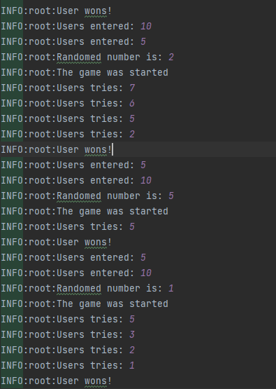

# labsPP
___
Разработал Гвоздев А.М. Фт-210008
---
---
Компьютер загадывает число от 1 до N. У пользователя k попыток отгадать. После каждой неудачной попытки компьютер сообщает меньше или больше загаданное число. В конце игры текст с результатом (или «Вы угадали», или «Попытки закончились»). 
---
---
Открывать файл lab9.py в любой IDE поддерживающей Python
---
---
Примеры работы программы
